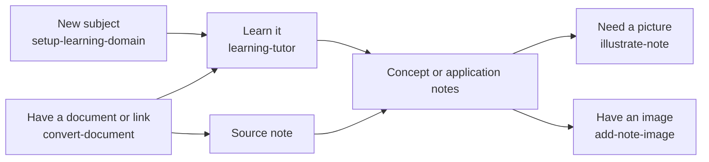

# Skills

A quick guide to what each skill does and when to use it. Call a skill with `/<skill-name>` in Claude Code or `$<skill-name>` in Codex. You can also just ask in plain words, like the examples below, and the tool picks the matching skill.

Each skill's full instructions live in `.claude/skills/<skill-name>/SKILL.md`. To set up or change skills, see the [skill management guide](.claude/README.md).

## Table Of Contents

- [Quick Lookup](#quick-lookup)
- [Which Skill When](#which-skill-when)
- [Bundled Scripts](#bundled-scripts)
- [Add A Skill](#add-a-skill)

## Quick Lookup

| Skill | What it does | Example request |
| --- | --- | --- |
| [`setup-learning-domain`](.claude/skills/setup-learning-domain/SKILL.md) | Finds the right `knowledge/` domain for a new topic, or creates its folders and index links. Interviews you first if the request is unclear. | *I want to start learning cooking.* |
| [`learning-tutor`](.claude/skills/learning-tutor/SKILL.md) | Finds your starting point, plans a learning path, and teaches step by step through conversation. | *Teach me how databases work. I have 20 minutes a day.* |
| [`convert-document`](.claude/skills/convert-document/SKILL.md) | Converts a PDF, Office file, EPUB, web page, or YouTube link to Markdown with MarkItDown, for reading or making a source note. | *Read ~/Downloads/owners-manual.pdf and make a source note.* |
| [`illustrate-note`](.claude/skills/illustrate-note/SKILL.md) | Creates a concept explainer, mechanism diagram, or mind map and adds it to the right note. | *Draw how oil circulates through the engine in the engine oil note.* |
| [`add-note-image`](.claude/skills/add-note-image/SKILL.md) | Adds an existing image, screenshot, or video frame to the right section of a note. | *Add ~/Downloads/filter-cutaway.jpg to the oil filter step.* |
| [`manage-project-skills`](.claude/skills/manage-project-skills/SKILL.md) | Creates, updates, renames, or removes skills shared by Claude Code and Codex. | *Create a skill for turning an article into a source note.* |

## Which Skill When

| Situation | Skill | Writes to |
| --- | --- | --- |
| Starting a new subject | `setup-learning-domain` → `learning-tutor` | `knowledge/<domain>/` · `knowledge/README.md` · `README.md` |
| Learning or practicing | `learning-tutor` | the conversation · notes in `knowledge/` or `learning/` when you ask to save |
| Reading a PDF, Office file, EPUB, or link | `convert-document` | `.cache/markitdown/` (not committed) · `sources/<type>/` for a source note |
| Explaining an idea with a visual | `illustrate-note` | the note · `knowledge/<domain>/assets/<note-slug>/` for SVG files |
| Adding an image you already have | `add-note-image` | the note · `knowledge/<domain>/assets/<note-slug>/` |
| Changing the skills themselves | `manage-project-skills` | `.claude/skills/` · this file |

After changing files, agents commit and push as described in [AGENTS.md](AGENTS.md#commit-and-push).

## Bundled Scripts

Skills run these scripts, and you can run them yourself from the repository root.

| Script | What it does |
| --- | --- |
| [`ensure_domain.py`](.claude/skills/setup-learning-domain/scripts/ensure_domain.py) | Creates a domain's `README.md`, `concepts/`, and `applications/` if missing, and adds its index links. Supports `--dry-run`. Used by `setup-learning-domain`. |
| [`to_markdown.py`](.claude/skills/convert-document/scripts/to_markdown.py) | Converts a file or URL to Markdown with MarkItDown, splits PDFs into `## Page N` sections, and caches output in `.cache/markitdown/`. Used by `convert-document`. |

## Add A Skill

1. Create one file at `.claude/skills/<skill-name>/SKILL.md`. Codex sees it automatically through the `.agents/skills` symlink.
2. Add a row to [Quick Lookup](#quick-lookup) and, if it fits, to [Which Skill When](#which-skill-when). List any script it adds under [Bundled Scripts](#bundled-scripts).

The `manage-project-skills` skill does both steps for you.
