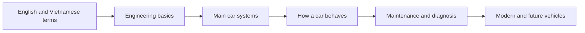

# Automobile Engineering

Use this domain to learn how cars work, how engineers design them, and how to apply that knowledge in real situations.

Start with [English–Vietnamese Automobile Terms](english-vietnamese-terms.md). Continue with the [Engineer-Level Terminology Library](terminology/README.md), then use the [Automobile Engineering Knowledge Map](knowledge-map.md) to see how the subjects and car systems connect.

## How To Use This Domain

1. Learn the important English terms for the topic.
2. Save useful books, articles, videos, or courses as source notes under `sources/`.
3. Write one reusable idea per note under `concepts/`.
4. Put maintenance, diagnosis, comparison, or design exercises under `applications/`.
5. Link finished notes in the indexes below.

## Learning Roadmap

### 1. Engineering Basics

- [ ] Force, work, energy, power, and torque
- [ ] Motion, friction, heat, fluids, and electricity
- [ ] Materials, manufacturing, and basic control systems

### 2. Main Car Systems

- [ ] Engine or electric motor
- [ ] Transmission and drivetrain
- [ ] Steering, suspension, brakes, wheels, and tires
- [ ] Fuel, cooling, lubrication, exhaust, and emissions
- [ ] Electrical and electronic systems
- [ ] Body, safety systems, climate control, and interior

### 3. How A Car Behaves

- [ ] Acceleration, braking, and cornering
- [ ] Grip, weight transfer, ride, and handling
- [ ] Aerodynamics, efficiency, noise, and vibration

### 4. Maintenance And Diagnosis

- [ ] Routine maintenance and inspection
- [ ] Warning lights and diagnostic trouble codes
- [ ] A safe, step-by-step fault-finding process

### 5. Modern And Future Vehicles

- [ ] Internal-combustion, hybrid, plug-in hybrid, and battery-electric vehicles
- [ ] Batteries, charging, regenerative braking, and thermal management
- [ ] Driver-assistance, connected-car, and vehicle software systems

## Key Concepts

- [Maintenance Decisions](concepts/maintenance-decisions.md)
- [Engine Oil And Filter Care](concepts/engine-oil-and-filter-care.md)

## Applications

- [Car Service And Maintenance Learning Path](applications/car-service-and-maintenance-learning-path.md)

## Important Sources

- Add source links here when useful.

## Open Questions

- Which car system do I want to understand first?
- Do I want to focus more on engineering design, repair and maintenance, driving behavior, or car technology?
