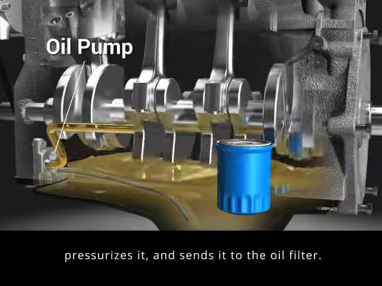
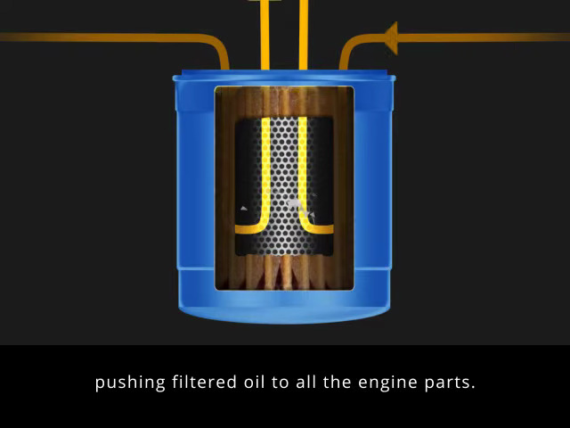
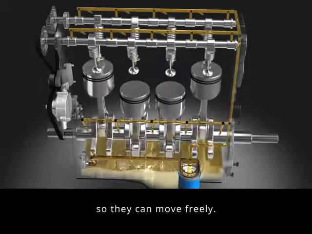

# Engine Oil And Filter Care

## Table Of Contents

- [Concept](#concept)
- [Background And Context](#background-and-context)
- [How Lubrication Works](#how-lubrication-works)
- [Follow The Oil Through The Engine](#follow-the-oil-through-the-engine)
- [Why Oil And Its Filter Need Attention](#why-oil-and-its-filter-need-attention)
- [Concrete Example](#concrete-example)
- [Mental Model And Summary](#mental-model-and-summary)
- [How To Apply](#how-to-apply)
- [Reference Engine Maintenance Schedules](#reference-engine-maintenance-schedules)
  - [Suzuki Passenger-Car Reference](#suzuki-passenger-car-reference)
  - [How To Read Time And Distance](#how-to-read-time-and-distance)
  - [From Handover To Four Years](#from-handover-to-four-years)
  - [Longer-Term Milestones And Different Component Types](#longer-term-milestones-and-different-component-types)
  - [Adjusting The Reference To Real Use](#adjusting-the-reference-to-real-use)
- [BMW 330i Reference](#bmw-330i-reference)
  - [BMW Milestones From New To Long-Term Use](#bmw-milestones-from-new-to-long-term-use)
  - [Reading The Reminder In Practice](#reading-the-reminder-in-practice)
- [Practice Question](#practice-question)
- [Sources](#sources)
- [Related Notes](#related-notes)

## Concept

Why does an engine need oil and an oil filter, and why is a correct oil level not enough to decide whether an oil change is due?

## Background And Context

Inside a running engine, pistons move up and down while a shaft called the **crankshaft** rotates to carry power toward the transmission. Moving surfaces experience heavy loads. Direct contact between them causes friction, heat, and wear.

Engine care includes maintaining the lubrication that helps these parts keep moving without excessive wear.

## How Lubrication Works

Engine oil forms a thin protective film between many moving surfaces. Reducing friction and wear with a lubricant is called **lubrication**.

Think of sliding something heavy across a dry surface compared with a surface that has a slippery layer. The layer makes movement easier. Inside an engine, the oil film must also work under heat and load. This analogy explains the basic idea, but does not mean that any slippery liquid is suitable engine oil.

An oil pump circulates oil through the engine. Oil also carries away some heat and helps manage contaminants.

```text
Moving metal surface
--------------------
Thin protective oil film
--------------------
Other metal surface
```

This is a simplified view of surfaces separated by an oil film. The amount of separation changes with operating conditions.

## Follow The Oil Through The Engine

These frames come from [Valvoline MEA - How Engine Oil Works](https://www.youtube.com/watch?v=IGyuWI5Lga8), published by Valvoline Middle East & Africa. They show a simplified lubrication system, not the verified layout of either car in the learning path. The original frame content and on-screen captions are retained; the explanations below are learning notes.

**1. The pump draws oil from the sump.** The sump is the reservoir at the bottom of the engine shown here. The pump draws oil from it and sends oil toward the filter.



*Frame at [00:06](https://www.youtube.com/watch?v=IGyuWI5Lga8&t=6s). Look at the oil collected below the crankshaft and the labelled pump beside it.*

**2. Oil passes through the filter.** The arrows show oil entering around the outside of the filter element, passing through it, and leaving through the centre. The pump drives this flow; the filter traps particles.



*Frame at [00:12](https://www.youtube.com/watch?v=IGyuWI5Lga8&t=12s). Follow the arrows from the outer channels toward the centre. This illustrates flow direction, not every detail of a real filter.*

**3. Oil reaches moving parts through internal passages.** These passages are often called **oil galleries**. The highlighted paths show oil being distributed to parts such as crankshaft bearings and the valve train, which opens and closes the engine's valves. After lubricating parts, oil drains back toward the sump to circulate again.



*Frame at [00:19](https://www.youtube.com/watch?v=IGyuWI5Lga8&t=19s). Notice that oil must reach both the lower and upper parts of the engine.*

Remember the simplified route: **sump → pump → filter → moving parts → sump**. Actual engines can add branches and components, such as an oil cooler.

## Why Oil And Its Filter Need Attention

Oil and the filter perform related jobs, but they deteriorate in different ways:

| Item | Job | Why it needs attention |
| --- | --- | --- |
| Engine oil | Lubricate moving surfaces and help carry heat and contaminants away | Heat and chemical reactions gradually change the oil; contamination can reduce its ability to protect the engine |
| Oil filter | Trap many solid particles carried by the oil | Its capacity to hold particles is limited; it cannot remove every kind of contamination or restore degraded oil |

A filter cannot make old oil new again. Fresh oil also does not restore a used filter's capacity to hold more particles. Follow the applicable service guidance for replacing both.

## Concrete Example

Suppose a workshop quotes an engine oil change and a new oil filter as scheduled work.

The oil change replaces the used lubricant and removes much of the contamination carried in it. The new filter restores the filter's capacity to capture particles.

Now suppose the oil level is already correct. That tells you how much oil is present. It does not establish whether the oil is still fit for service, so it is not sufficient evidence to postpone a required oil change.

Adding oil can correct a low level, but it does not remove the old oil and its contaminants.

## Mental Model And Summary

**Oil level tells you quantity. Oil condition tells you how well the oil can still do its job. The filter catches particles, but cannot renew the oil.**

Oil-level checks and scheduled oil changes answer different maintenance needs. Use the required oil specification and applicable service guidance for the particular engine.

## How To Apply

When reviewing an engine-service quote:

- Identify the oil and oil-filter items and explain the purpose of each.
- Check why the work is due using the vehicle's service information and reminders.
- Confirm that the proposed oil meets the specification required for the correct vehicle, engine, and market.

The reference schedule below helps with planning. Exact oil specifications, quantities, checking procedures, and service intervals have not been verified for either car in the learning path. Reading an oil specification is a next learning step.

## Reference Engine Maintenance Schedules

Choose the relevant example: [Suzuki passenger cars](#suzuki-passenger-car-reference) or [BMW 330i](#bmw-330i-reference). Each section states which market and source it covers.

### Suzuki Passenger-Car Reference

The following is a worked example from [Suzuki Vietnam's passenger-car maintenance schedule](https://suzuki.com.vn/pages/bao-duong-dinh-ky-o-to), checked on 25 September 2026. The detailed tasks come from the [passenger-car service table on that page](https://d2i5n8imv7zpm3.cloudfront.net/undefinedPC_1789723794055.jpg). It provides concrete milestones from a new car through long-term use.

**Scope:** this is a published Suzuki passenger-car example. Its applicability to the learner's reported 2024 Jimny remains unverified. The BMW 330i needs its own applicable service information and service-status reminders. Use the correct car's documents when making an actual booking or buying fluids and parts.

ASSUMPTION: The example concerns a petrol passenger car. The table contains alternatives for different spark plugs and coolants; only the branch matching the actual car applies.

### How To Read Time And Distance

- **Whichever comes first:** at a listed limit of 7,500 km or 6 months, arrange the service at 6 months even if the car has travelled only 4,000 km. If it reaches 7,500 km in 3 months, the distance limit comes first.
- **Read milestones as total distance and elapsed service time:** 15,000 km / 12 months is the next listed milestone after 7,500 km / 6 months, not another 15,000 km after that visit. Confirm the manufacturer's starting date for counting service time.
- **Inspect and replace are different:** the source uses `I` for inspection and adjustment, and `R` for replacement. Inspection may lead to earlier replacement if a problem is found.
- **Keep recurring visits going:** the longer-term milestones below add tasks to the ongoing oil, filter, and inspection cycle. After early or late work, have the workshop record the next due date and odometer reading for each item.

### From Handover To Four Years

The handover and monthly rows are suggested owner-planning habits. The numbered service milestones and replacement tasks are taken from the Suzuki example. This table covers engine care; the full vehicle schedule also includes brakes, tyres, transmission, and other systems.

| Milestone: distance OR time, whichever comes first | Engine-care action | What it achieves |
| --- | --- | --- |
| **Handover: new car** | Record the delivery date, odometer, service-time starting date, and first service due. Obtain the manual and service booklet. Record the required oil approval, viscosity grade, and coolant specification. Read the running-in instructions. | Establishes a reliable starting point and avoids buying an unsuitable fluid. |
| **Every month and before a long trip — suggested reminder** | Check the service display, oil level using the manual's procedure, visible leaks, and coolant level as the manual allows. Record oil added and the odometer reading. Check coolant when cold; never open a hot, pressurised cooling system. | Helps notice changes between workshop visits. |
| **1,000 km / 1 month** | In this Suzuki example, replace **engine oil and oil filter**. Inspect the drive belt, engine air filter, cooling hoses/connections, and exhaust. | Completes the first scheduled service. An early oil change is a source-specific requirement here, not a universal rule for every new engine. |
| **7,500 km / 6 months** | Replace **engine oil**. Inspect the **oil filter**, engine air filter, drive belt, cooling hoses/connections, and exhaust. | Renews the oil and checks components that can deteriorate. The source marks the oil filter for inspection at this visit. |
| **15,000 km / 12 months** | Replace **engine oil and oil filter**. Repeat the engine air-filter, drive-belt, cooling-system, and exhaust inspections. | Replaces the filter at its scheduled milestone as well as renewing the oil. |
| **22,500 km / 18 months** | Repeat the **7,500 km / 6-month** set of tasks. | Continues the smaller service between larger visits. |
| **30,000 km / 24 months** | Replace **engine oil, oil filter, engine air filter, and the engine drive belt listed in the source**. Continue hose/connection and exhaust inspections. | Adds scheduled replacement of the air filter and drive belt. Confirm which belt this means for the actual engine; it is not a timing-chain replacement instruction. |
| **37,500 km / 30 months** | Repeat the **7,500 km / 6-month** set of tasks. | Keeps the recurring checks and oil service going. |
| **45,000 km / 36 months** | Replace **engine oil and oil filter**. The source also calls for **nickel spark plugs**, if fitted, and **Suzuki standard LLC coolant**, if that is the specified coolant. Continue the other inspections. | Adds ignition and coolant tasks for the applicable component/fluid types. The iridium-plug and Super LLC branches have different limits below. |
| **52,500 km / 42 months** | Repeat the **7,500 km / 6-month** set of tasks. | Continues routine engine care. |
| **60,000 km / 48 months** | Repeat the **30,000 km / 24-month** set of tasks. The source also lists a **valve-clearance inspection** at this milestone. | Adds a check of the gap in the valve mechanism where that service requirement applies. |

The source's first-service policy describes free labour at 1,000 km or 1 month. This does not mean that oil, filters, or other materials are free.

### Longer-Term Milestones And Different Component Types

Continue the recurring services between these milestones. The source's main grid runs to 60,000 km / 48 months, while separate notes specify the following longer intervals.

| Item or milestone | Published reference | How to use it |
| --- | --- | --- |
| **Recurring service visits after 60,000 km / 48 months** | The page describes small, medium, and large service cycles, including a large service every **30,000 km / 24 months**. | Obtain the continuing schedule for the exact car and carry forward each item's due date. An older engine still needs routine oil service between larger milestones. |
| **PCV valve and evaporative-emissions system** | Inspect every **90,000 km / 72 months**. | PCV handles crankcase gases; the evaporative system controls fuel vapour. An inspection is not an instruction to replace every component. |
| **Iridium spark plugs, if fitted** | Replace every **105,000 km / 84 months**. | Use this branch only if the correct vehicle documents specify these plugs and this interval. The nickel-plug branch above is different. |
| **In-tank fuel filter, where applicable** | Replace every **105,000 km**; this row does not give a time limit. | Confirm that the listed filter and interval apply to the car. No time limit has been added here. |
| **Suzuki Super LLC coolant: first replacement** | **150,000 km / 96 months**. | Applies to the specified Super LLC coolant, described as blue in the source. Confirm the product specification; colour alone is not enough to choose or mix coolant. |
| **Suzuki Super LLC coolant: later replacements** | Every **75,000 km / 48 months after replacement**. | This is an interval since the last replacement, unlike the first-change milestone. Record both the date and odometer when coolant is changed. |

### Adjusting The Reference To Real Use

The source flags some items for more frequent attention according to their actual condition. Dust, repeated short trips, long idling, towing, or other demanding use can change the applicable maintenance requirements. Check the manufacturer's definition of severe use and the affected items before changing the schedule.

An oil-pressure warning, overheating, a new leak, or unusual engine noise needs attention when it appears. A future service appointment does not make a current warning safe to ignore; follow the vehicle's warning instructions.

For each completed service, record **date, odometer, work performed, oil/fluid specification, parts fitted, and next due date/odometer**. Keep the invoice so the schedule has evidence behind it.

OPEN QUESTION: Which service booklet and schedule apply to the actual Jimny's model year, market, and configuration? Confirm whether the published Suzuki passenger-car table above applies before adopting it.

## BMW 330i Reference

**Starting point:** the learning path records a BMW 330i LCI M Sport, reported year 2025. Its current service display, VIN-specific maintenance checklist, and service history have not yet been reviewed.

BMW uses **Condition Based Service (CBS)**. It uses time, driving distance, operating conditions, sensors, and calculations to forecast when maintenance is due. [THACO AUTO BMW Hanoi explains](https://bmwhn.vn/dich-vu-bao-duong-dinh-ky-tron-goi/) that the vehicle shows the remaining distance and time, and the service centre reads the vehicle data to identify the required work.

This gives two planning rules: **follow the car's oil-service date and remaining kilometres, and have the workshop check the additional tasks linked to that service.** An air filter or spark-plug task may be due without having its own separate reminder in iDrive.

### BMW Milestones From New To Long-Term Use

**Source boundary:** the replacement tasks and approximate distances below come from [BMW's official U.S. 2025 Maintenance booklet](https://www.bmwusa.com/content/dam/bmw/marketUS/common/warranty-books/2025/BMW_MY25_Maintenance_with_BEVs.pdf), using the **3, 5, 7 Series** column. They are a reference for understanding the pattern, not confirmed Vietnam-market intervals for this particular 330i. The booklet itself says the service centre should use the latest applicable maintenance information.

| Stage or milestone | Engine-care action | How to decide when it is due |
| --- | --- | --- |
| **Handover** | Keep the delivery inspection and service documents. Record the initial oil-service date and remaining distance. Confirm the required BMW oil approval, viscosity grade, and coolant specification using the car's manual. | BMW describes a pre-delivery inspection. Recording the values is a suggested owner habit. |
| **Initial running-in period** | Follow the 330i's running-in instructions. Confirm any early service instruction against the car's documents. | The booklet's **1,200-mile running-in oil service applies to the listed BMW M models**. A 330i with the M Sport package is not an M3; that M-model service does not establish a compulsory early oil change for this car. |
| **First scheduled engine-oil service** | Replace **engine oil and oil filter together**. Have the service centre record the work and update the relevant CBS entry. | Use the due date and remaining distance shown by the vehicle, with its applicable service instructions. The reported "7k km" needs clarification before entering a fixed first-service target. |
| **Every subsequent scheduled engine-oil service** | Replace **engine oil and oil filter together**, and check the additional work due at that service-counter number. | Follow each new CBS forecast. Ask for the vehicle-specific checklist, including tasks that do not have a separate dashboard reminder. |
| **Every third scheduled oil service — U.S. reference: about 30,000 miles / 48,000 km** | Replace the **engine air filter**; the booklet calls for more frequent replacement in dusty conditions. | The U.S. 3 Series table links this to the third oil-service occurrence. Confirm the interval for the Vietnam car before adopting this distance. |
| **Every sixth scheduled oil service — U.S. reference: about 60,000 miles / 97,000 km** | Replace **spark plugs**. Under that reference cycle, the engine air filter is also due because this is another third-service occurrence. | Confirm the car's service-counter requirements and correct plug specification. The distance is approximate and is not a universal six-year rule. |
| **Cooling system throughout ownership** | Check level and condition as instructed, and investigate leakage or overheating. Use the specified coolant and replacement procedure. | The U.S. booklet describes engine coolant as a long-term fluid, with replacement during repairs unless otherwise specified. It does not establish a fixed coolant-change interval for this Vietnam car. Obtain the applicable local instruction. |
| **Belts, hoses, seals, and higher-mileage care** | Include condition checks in the workshop plan and act on deterioration, leaks, or diagnosed faults. Continue recurring oil, filter, and other scheduled work as the car ages. | No fixed replacement mileage for these parts has been verified for this 330i. Have the workshop identify scheduled tasks and condition-based recommendations separately. |

The kilometre figures are rounded conversions of the booklet's approximate mile figures. **A scheduled oil-service counter is not automatically the same as the number of oil changes on your invoices.** If you choose an extra oil change between scheduled services, ask the workshop how it will record that work and preserve the correct schedule for the other items.

### Reading The Reminder In Practice

Open the vehicle's **Service requirements / Service status** screen and select **Engine oil**. The menu wording and route depend on the installed iDrive version. Record both the date and the remaining distance. My BMW may also show service needs where that feature is available.

For example, **if** the odometer reads 4,000 km and the oil-service screen explicitly says **7,000 km remaining**, the current forecast is around 11,000 km total, subject to the displayed date and later CBS updates. A workshop instruction saying "service at 7,000 km" could instead mean the total odometer reading. This example does not resolve the learner's actual reminder.

| Information needed for this 330i | Current status |
| --- | --- |
| Oil-service due date | OPEN QUESTION: not provided |
| Oil-service remaining kilometres and current odometer | OPEN QUESTION: current readings not provided; the learning path's earlier odometer report was around 4,000 km |
| Meaning of the reported "7k km" guidance | OPEN QUESTION: total odometer reading or remaining distance? |
| Local interval for engine air filter, spark plugs, and coolant | OPEN QUESTION: confirm using the vehicle-specific BMW maintenance checklist |
| Required oil approval, viscosity, and filling quantity | OPEN QUESTION: confirm in the manual/service data for this engine and market |

BMW Vietnam's [Service Inclusive page](https://www.bmw.vn/vi/services-workshop/services-and-workshop-2025/) describes package durations and kilometre limits. Those figures describe the coverage period; the car's applicable maintenance requirements determine when individual tasks are due.

## Practice Question

OPEN QUESTION: A car's oil level is correct, but its scheduled oil change is due. Would the correct level be a good reason to postpone the change? Why?

This question is still open from the learning session; understanding has not yet been checked.

## Sources

- Based on the introductory engine-care lesson in the car-service and maintenance learning session.
- [Valvoline MEA - How Engine Oil Works](https://www.youtube.com/watch?v=IGyuWI5Lga8) — Valvoline Middle East & Africa. Source of the animation frames at 00:06, 00:12, and 00:19. These illustrate oil circulation; they do not establish vehicle-specific service requirements or an oil-brand recommendation.
- [Internal-combustion engine terminology](../terminology/internal-combustion-engine.md#lubrication-and-cooling) — supporting vocabulary for oil, lubrication, pumps, and filters.
- [Suzuki Vietnam: periodic car maintenance](https://suzuki.com.vn/pages/bao-duong-dinh-ky-o-to) and its [passenger-car service table](https://d2i5n8imv7zpm3.cloudfront.net/undefinedPC_1789723794055.jpg) — reviewed on 25 September 2026 for the reference timeline, inspection/replacement distinctions, and component-specific intervals. Applicability to the learner's exact vehicles has not been confirmed.
- [BMW U.S. 2025 Maintenance booklet](https://www.bmwusa.com/content/dam/bmw/marketUS/common/warranty-books/2025/BMW_MY25_Maintenance_with_BEVs.pdf) — reviewed on 25 September 2026. Printed pp. 1–2 explain CBS and combined service tasks; p. 4 covers oil selection and long-term coolant; p. 8 lists the M-model running-in service; pp. 10–12 cover current-information limits and the service tables. The 3 Series column specifies engine air-filter replacement at every third scheduled oil service and spark plugs at every sixth. U.S. scope; local applicability remains unverified.
- [THACO AUTO BMW Hanoi: Service Inclusive and service FAQ](https://bmwhn.vn/dich-vu-bao-duong-dinh-ky-tron-goi/) — reviewed on 25 September 2026 for the local explanation of CBS, dashboard reminders, My BMW, and workshop access to service data.
- [BMW Vietnam: services and workshop](https://www.bmw.vn/vi/services-workshop/services-and-workshop-2025/) — reviewed on 25 September 2026 for service-package coverage and service support; this page does not provide a 330i engine-maintenance interval table.
- The exact vehicles' manuals and service booklets have not yet been reviewed. The animation is an explanation of oil circulation, not a maintenance-schedule source.

## Related Notes

- [Maintenance Decisions](maintenance-decisions.md) — connect a service action with evidence and an applicable requirement.
- [Car Service And Maintenance Learning Path](../applications/car-service-and-maintenance-learning-path.md) — introductory lesson for Stage 4: understand engine care.
