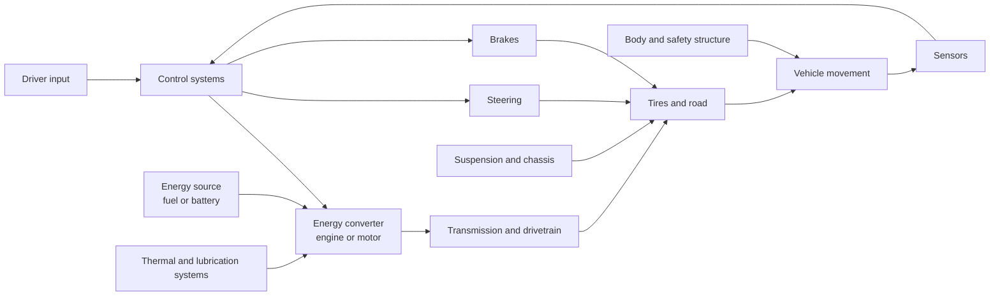

# Automobile Engineering Knowledge Map

This map organizes the main knowledge needed to understand cars. It is a learning guide, not a fixed university curriculum.

## Table Of Contents

- [Big Picture](#big-picture)
- [How A Car Works As One System](#how-a-car-works-as-one-system)
- [Main Knowledge Areas](#main-knowledge-areas)
- [Recommended Learning Order](#recommended-learning-order)
- [Suggested First Notes](#suggested-first-notes)
- [Learning Questions](#learning-questions)

## Big Picture

```mermaid
flowchart TD
  A[Automobile Engineering]

  A --> B[Engineering Foundations]
  B --> B1[Mechanics and motion]
  B --> B2[Thermodynamics and fluids]
  B --> B3[Electricity and electronics]
  B --> B4[Materials and manufacturing]
  B --> B5[Control systems and software]

  A --> C[Vehicle Systems]
  C --> C1[Power and propulsion]
  C --> C2[Transmission and drivetrain]
  C --> C3[Steering suspension and tires]
  C --> C4[Brakes]
  C --> C5[Body structure and safety]
  C --> C6[Electrical and electronic systems]
  C --> C7[Cooling lubrication and climate]

  A --> D[Vehicle Performance]
  D --> D1[Acceleration and top speed]
  D --> D2[Braking and cornering]
  D --> D3[Ride comfort and handling]
  D --> D4[Efficiency and emissions]
  D --> D5[Noise vibration and harshness]
  D --> D6[Reliability and durability]

  A --> E[Engineering Process]
  E --> E1[Requirements and trade-offs]
  E --> E2[Design and simulation]
  E --> E3[Prototyping and testing]
  E --> E4[Production and quality]
  E --> E5[Maintenance and diagnosis]
  E --> E6[Recycling and end of life]

  A --> F[Vehicle Technologies]
  F --> F1[Internal-combustion vehicles]
  F --> F2[Hybrid vehicles]
  F --> F3[Battery-electric vehicles]
  F --> F4[Fuel-cell vehicles]
  F --> F5[Driver-assistance systems]
  F --> F6[Connected and software-defined vehicles]
```

## How A Car Works As One System

A car is a group of systems working toward one result: controlled movement. The driver asks the car to accelerate, turn, or stop. Energy and control systems turn that request into motion.

The arrows show relationships, not every physical connection inside a real car.

## Main Knowledge Areas

| Area | What to study | Main question |
| --- | --- | --- |
| Engineering foundations | Force, torque, energy, heat, fluids, circuits, materials, and controls | What physical rules make a car work? |
| Power and propulsion | Engines, motors, batteries, fuel systems, charging, cooling, and emissions | Where does movement energy come from? |
| Transmission and drivetrain | Clutches, gearboxes, differentials, shafts, axles, and drive layouts | How does power reach the wheels? |
| Chassis and vehicle dynamics | Steering, suspension, tires, grip, weight transfer, and aerodynamics | How does the car move, turn, and remain stable? |
| Braking | Friction brakes, hydraulic systems, ABS, and regenerative braking | How does the car slow down safely? |
| Body and safety | Structure, crash energy, restraints, visibility, and occupant protection | How does the car protect people? |
| Electrical and software | Power supply, sensors, actuators, networks, ECUs, diagnostics, and control software | How does the car sense, decide, and act? |
| Comfort and usability | Climate control, seating, noise, vibration, lighting, and human factors | How does the car support the people inside it? |
| Engineering and production | Requirements, trade-offs, CAD, simulation, testing, manufacturing, and quality | How is a car designed and built? |
| Ownership and service | Inspection, maintenance, fault finding, repair, cost, and reliability | How is a car kept safe and useful? |

## Recommended Learning Order

This order first builds the language needed to study. It then moves from the whole car to its parts and reconnects the parts as one system.

## Suggested First Notes

Create each item as one atomic concept note under `concepts/`.

- [ ] `force-work-energy-and-power.md`
- [ ] `torque-and-horsepower.md`
- [ ] `four-stroke-engine-cycle.md`
- [ ] `electric-motor-basics.md`
- [ ] `transmission-purpose.md`
- [ ] `differential-purpose.md`
- [ ] `tire-grip.md`
- [ ] `weight-transfer.md`
- [ ] `hydraulic-braking.md`
- [ ] `anti-lock-braking-system.md`
- [ ] `suspension-purpose.md`
- [ ] `vehicle-electrical-system.md`
- [ ] `electronic-control-unit.md`
- [ ] `on-board-diagnostics.md`
- [ ] `battery-electric-vehicle-architecture.md`

Create practical notes under `applications/` when you begin using the knowledge.

- [ ] `basic-car-inspection.md`
- [ ] `reading-dashboard-warning-lights.md`
- [ ] `diagnosing-a-car-problem.md`
- [ ] `comparing-car-powertrains.md`
- [ ] `car-maintenance-plan.md`

## Learning Questions

- What happens between pressing the accelerator and the car moving?
- Why do engines and electric motors need different drivetrain designs?
- What determines tire grip during acceleration, braking, and cornering?
- How do engineers balance safety, cost, comfort, performance, and efficiency?
- How do sensors, control units, and actuators cooperate?
- Which systems require regular maintenance, and why?
- How does changing one component affect the rest of the vehicle?
