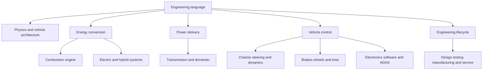

# Engineer-Level Automobile Terminology

This library collects the English terms needed to read textbooks, service information, specifications, test reports, and engineering discussions. Vietnamese translations help understanding, but the English term remains the main reference because Vietnamese usage can vary.

**Confidence:** `needs-review`

These are learning definitions, not approved legal translations or vehicle-specific repair instructions. Before using a term in a safety requirement, drawing, regulatory document, or repair procedure, verify it against the applicable standard or manufacturer manual.

## Table Of Contents

- [How The Library Is Organized](#how-the-library-is-organized)
- [Terminology Areas](#terminology-areas)
- [How To Read An Entry](#how-to-read-an-entry)
- [How To Find A Term](#how-to-find-a-term)
- [Engineering Language Rules](#engineering-language-rules)
- [Study Method](#study-method)
- [Standards And References](#standards-and-references)

## How The Library Is Organized



## Terminology Areas

1. [Foundations And Vehicle Architecture](foundations-and-vehicle-architecture.md)
2. [Internal-Combustion Engine](internal-combustion-engine.md)
3. [Electric, Hybrid, And Fuel-Cell Systems](electric-hybrid-and-fuel-cell-systems.md)
4. [Transmission And Drivetrain](transmission-and-drivetrain.md)
5. [Chassis, Steering, Suspension, And Vehicle Dynamics](chassis-steering-suspension-and-dynamics.md)
6. [Brakes, Wheels, And Tires](brakes-wheels-and-tires.md)
7. [Electrical, Electronics, Controls, Software, And ADAS](electrical-electronics-controls-and-adas.md)
8. [Design, Testing, Manufacturing, Safety, And Service](design-testing-manufacturing-safety-and-service.md)

## How To Read An Entry

Each table uses four fields:

- **English term:** the term to recognize and use in technical work
- **Common Vietnamese:** a practical translation; alternatives appear when usage varies
- **Engineering meaning:** a precise explanation in simple English
- **Symbol, unit, or note:** common symbols, SI units, abbreviations, or an important distinction

An abbreviation such as `ABS` or `ECU` should be learned together with its full English name.

## How To Find A Term

In VS Code, press `Command+Shift+F` on macOS or `Ctrl+Shift+F` on Windows and Linux. Search for the full English term or its abbreviation across the `terminology/` folder.

From a terminal at the repository root, use:

```sh
rg -n -i "term or abbreviation" knowledge/automobile-engineering/terminology
```

Search the English term first. If it appears in more than one file, compare the subsystem contexts before choosing a meaning.

## Engineering Language Rules

- A **quantity** is what you measure, such as force or pressure.
- A **symbol** is the short mathematical name, such as `F` or `p`.
- A **unit** is the agreed measurement scale, such as newton (`N`) or pascal (`Pa`).
- Mass and weight are different. Mass uses kilograms (`kg`); weight is a force and uses newtons (`N`).
- Power and energy are different. Power is a rate; energy is an accumulated amount.
- Gauge pressure and absolute pressure are different. Always check which reference a specification uses.
- An acronym can have different meanings in different subsystems. Confirm the context.
- Manufacturer terms are not always universal engineering terms.

## Study Method

Do not try to memorize the full library at once.

1. Choose one vehicle system.
2. Learn 10 terms from that system.
3. Draw the system and label its parts in English.
4. Explain the system in Vietnamese.
5. Explain it again in simple English.
6. Read one real specification or service diagram and highlight the terms.
7. Create an atomic concept note when a term represents an idea you need to understand deeply.

## Standards And References

These are useful authorities for checking formal terminology. Access and exact editions may vary.

- [BIPM SI Brochure](https://www.bipm.org/en/publications/si-brochure) for SI quantities and units
- [ISO Online Browsing Platform](https://www.iso.org/obp/ui/) for terms used in ISO standards
- ISO 8855 for vehicle dynamics and road-holding vocabulary
- SAE J670 for vehicle dynamics terminology
- ISO 11898 for Controller Area Network (`CAN`)
- ISO 14229 for Unified Diagnostic Services (`UDS`)
- ISO 26262 for road-vehicle functional safety
- SAE J2012 and ISO 15031-6 for diagnostic trouble code terminology

OPEN QUESTION: Find a reliable Vietnamese automotive standard or engineering textbook that can be used as the preferred source for Vietnamese translations.
