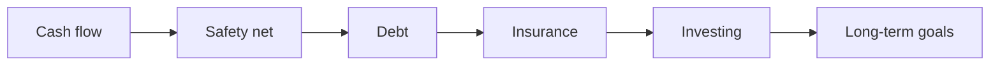

# Personal Finance

Use this domain to learn how money works in everyday life: earning, spending, saving, protecting, and growing it.

Keep only reusable knowledge here. Your real numbers (accounts, balances, salary, budgets, debts) belong in `private/finance/`, which is not committed to Git.

## Table Of Contents

- [How To Use This Domain](#how-to-use-this-domain)
- [Learning Roadmap](#learning-roadmap)
- [Key Concepts](#key-concepts)
- [Applications](#applications)
- [Important Sources](#important-sources)
- [Open Questions](#open-questions)

## How To Use This Domain

1. Save useful books, articles, videos, or courses as source notes under `sources/`.
2. Write one reusable idea per note under `concepts/` (for example, `emergency-fund.md`).
3. Put practical guides under `applications/` (for example, a monthly budget review process).
4. Keep personal data and decisions about your own money in `private/finance/`.
5. Link finished notes in the indexes below.

Simple test: if the note would still be useful to a friend with different numbers, it goes here. If it contains your own numbers, it goes in `private/finance/`.

## Learning Roadmap

- [ ] Cash flow: income, expenses, budgeting, tracking
- [ ] Safety net: emergency fund, savings accounts
- [ ] Debt: interest, credit cards, loans, paying debt down
- [ ] Protection: health, life, and property insurance
- [ ] Investing: compound interest, risk, diversification, fees
- [ ] Long-term goals: retirement, housing, education, taxes

## Key Concepts

- Add concept links here.

## Applications

- [Suzuki Jimny Car Loan](applications/suzuki-jimny/README.md): overview, checklist, and approval letter summary.

## Important Sources

- Add source links here when useful.

## Open Questions

- Add questions here when they shape future learning.
