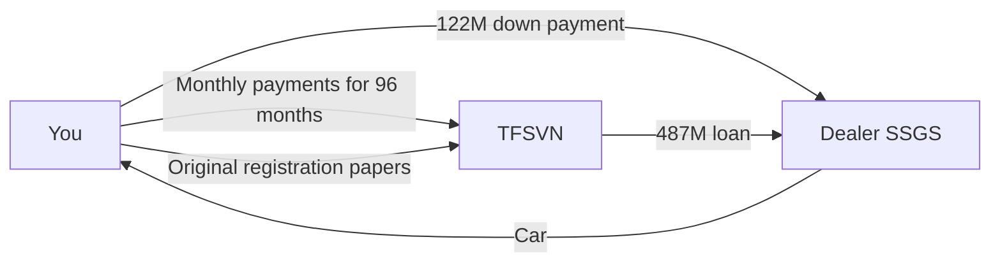

# Car Loan Approval Letter: Suzuki Jimny (TFSVN)

## Table Of Contents

- [Summary](#summary)
- [Related Concepts](#related-concepts)
- [Context](#context)
- [Loan At A Glance](#loan-at-a-glance)
- [How The Money Flows](#how-the-money-flows)
- [Estimated Monthly Payment](#estimated-monthly-payment)
- [How To Use](#how-to-use)
  - [Key Deadlines](#key-deadlines)
  - [Documents To Submit](#documents-to-submit)
  - [After You Get The Car](#after-you-get-the-car)
- [Risks And Limits](#risks-and-limits)
- [Sources](#sources)

## Summary

This note summarizes a car loan approval letter (Thư chấp thuận cấp tín dụng) from Toyota Financial Services Vietnam (TFSVN), dated 24/09/2026. It lists the loan terms, the deadlines, the documents still needed, and the points to check before signing the full contract.

An approval letter is not the loan contract yet. Think of it as a conditional "yes": the lender agrees in principle, but only if the information checks out and you sign and submit everything before the letter expires.

## Related Concepts

- Add concept links later (for example: amortized loan, fixed vs floating interest rate, prepayment fee).

## Context

- Lender: Công ty TNHH MTV Tài chính Toyota Việt Nam (TFSVN).
- Dealer (copied on the letter): Công ty Cổ phần Sài Gòn Ngôi Sao (SSGS).
- Purpose: consumer loan (Tiêu dùng) to buy a Suzuki car.

## Loan At A Glance

| Item | Value in the letter |
|---|---|
| Car | Suzuki Jimny GLX 4AT – Monotone |
| Estimated car price | 609,000,000 VND |
| Loan amount (paid to the dealer's account) | 487,000,000 VND |
| Down payment you cover (price − loan) | 122,000,000 VND (about 20%) |
| Loan product | CLASSIC TỐI ƯU, with a fee for early principal repayment |
| Interest rate | 9.75%/year on the reducing balance |
| Rate fixed for | First 12 months, then reset every 3 months |
| Loan term | 96 months (8 years) |
| Letter valid until | 23/12/2026 |

INFERENCE: The down payment is calculated from the letter's numbers (609M − 487M). The final price in the sales contract may differ, and it does not include registration fees, plate fees, or insurance.

### What "reducing balance" means

Interest is charged only on the money you still owe, not on the original 487M. Each month you pay some interest and some principal, so the balance goes down and the interest part shrinks over time.

Example: in month 1, interest is about 487,000,000 × 9.75% ÷ 12 ≈ 3.96M VND. Later, when the balance is lower, the interest part of each payment is smaller.

## How The Money Flows

You never receive the loan money directly. TFSVN pays the dealer, and TFSVN holds the original car registration as security until the loan is repaid.

## Estimated Monthly Payment

ASSUMPTION: Equal monthly payments (standard amortized loan). The letter does not state the payment amount or method. Confirm with TFSVN.

| Scenario | Estimated monthly payment |
|---|---|
| Months 1–12 at 9.75% | ≈ 7.33M VND |
| Balance left after 12 months | ≈ 444.7M VND |
| Months 13–96 if the rate rises to 11% | ≈ 7.61M VND |
| Months 13–96 if the rate rises to 12% | ≈ 7.85M VND |
| Total interest if 9.75% stayed the whole 8 years | ≈ 216M VND |

The 11% and 12% rows are only "what if" examples, not predictions. After month 12 the real rate depends on what TFSVN announces.

## How To Use

### Key Deadlines

- **24/10/2026**: The 9.75% rate is valid until this date. From 25/10/2026, the rate becomes whatever TFSVN announces at the time of disbursement.
  - INFERENCE: To lock in 9.75%, the loan likely needs to be disbursed by 24/10/2026. Confirm this with TFSVN or the dealer.
- **23/12/2026**: The approval letter expires. If the contract documents are not signed and submitted by then, the approval is cancelled automatically.

### Documents To Submit

The letter marks these as required (including documents from any co-borrower or guarantor):

- [ ] Copy (checked against the original) of the car sales contract and any appendices.
- [ ] Original credit application (Đề nghị cấp tín dụng), 2 signed copies on TFSVN's form.
- [ ] Original request to register the secured transaction (Đơn yêu cầu Đăng ký giao dịch bảo đảm), 1 signed copy on TFSVN's form.
- [ ] Copy (checked against the original) of the car physical damage insurance: contract, certificate, and invoice or receipt.
- [ ] Sign all documents in the credit contract set (Bộ Hợp Đồng Tín Dụng).

After TFSVN receives everything, it transfers the loan directly to the dealer.

### After You Get The Car

- The car must be registered in the borrower's name.
- Send the original vehicle registration (and vehicle file, if any) to TFSVN right after you receive it from the traffic police.

## Risks And Limits

- **Floating rate after 12 months**: The rate resets every 3 months after year 1. Monthly payments can go up. Plan your budget with a higher rate, not only 9.75%.
- **Early repayment costs money**: The product charges a fee when you pay principal early. The letter does not say how much.
- **The letter can still be changed or cancelled**: TFSVN can change or cancel the terms before the contract is signed, or if your financial situation gets worse, or if you did not report a negative event.
- **Approval depends on verification**: Everything you declared in the application will be checked.
- **Insurance is required**: Physical damage car insurance is a condition, so add its yearly cost to the true cost of the car.

OPEN QUESTION: What is the exact early repayment fee (percentage and how it changes by year)?

OPEN QUESTION: How is the rate set after month 12 (base rate + margin? which base rate)?

OPEN QUESTION: Is the monthly payment equal each month, or is principal fixed with interest on top (so payments start higher and fall)?

OPEN QUESTION: Must physical damage insurance be bought every year for all 96 months, and must it be bought through a specific insurer?

## Sources

- Approval letter from TFSVN, dated 24/09/2026. Original PDF kept locally at `private/finance/Approvalletter.pdf` (not committed to Git).
