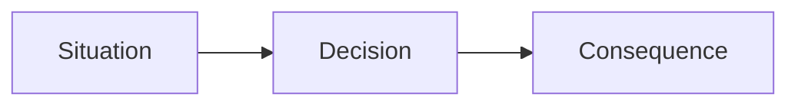

# Concept Name

Use the sections that help the reader understand this one idea. Combine or omit sections that add no value. For a self-explanatory concept, a direct explanation is enough; skip unnecessary background, derivation, and examples.

## Concept

Briefly identify the idea and the question this note answers. Keep this opening as orientation. If the idea needs context, build that context below before giving a full definition.

## Background And Context

What problem, need, or situation makes this concept useful? Why does it exist, and why does it matter? Explain the need without inventing a historical origin.

## Foundation

Identify the basic principles, assumptions, or building blocks needed to understand the idea. Explain only the prerequisites the reader needs. Use `ASSUMPTION:` for assumptions that the reasoning depends on.

## First Principles

Explain the fundamental idea that connects those building blocks. Why does it work? What must be true for it to work? Keep established facts, assumptions, and open questions distinct.

## How It Works

Build the concept step by step from the foundations. Make the reasoning clear to a smart beginner: show how each step leads to the next. Introduce the definition once these connections make it meaningful.

## Concrete Example

Immediately after the explanation, show a simple, realistic situation where the concept applies. Describe the starting situation, what happens, and the result. Connect these to the reasoning above instead of restating the definition. Omit this section when an example adds no value.

## Mental Model

Give the reader a simple way to remember and reason about the concept, such as a short rule or a useful analogy. State any important limit of that model.

## Summary

State the key takeaway in one or two sentences. Combine this with Mental Model if the two would repeat each other.

## How To Apply

- Life:
- Work:
- Business:

## Visual Representation

Use a Mermaid diagram, table, flow, matrix, or simple text diagram when possible.

## Sources

- Add source links when practical.

## Related Notes

- Add related notes only when useful.
