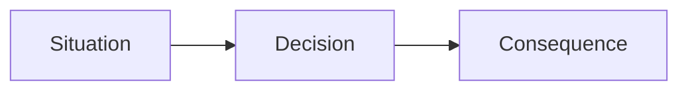

# Concept Name

## Summary

Write one or two sentences explaining the idea.

## Teach It Simply

Explain the idea as if teaching a smart beginner.

## Why It Matters

Explain why this idea matters for thinking, learning, life, work, or business.

## How To Apply

- Life:
- Work:
- Business:

## Examples

- Example 1:
- Example 2:

## Visual Representation

Use a Mermaid diagram, table, flow, matrix, or simple text diagram when possible.

## Sources

- Add source links when practical.

## Related Notes

- Add related notes only when useful.
